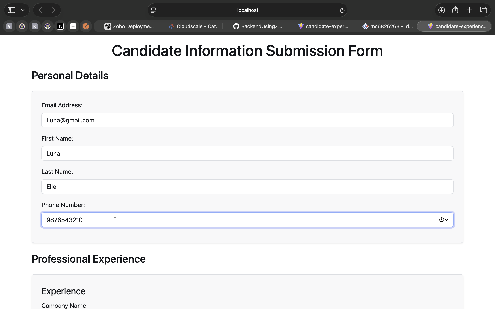
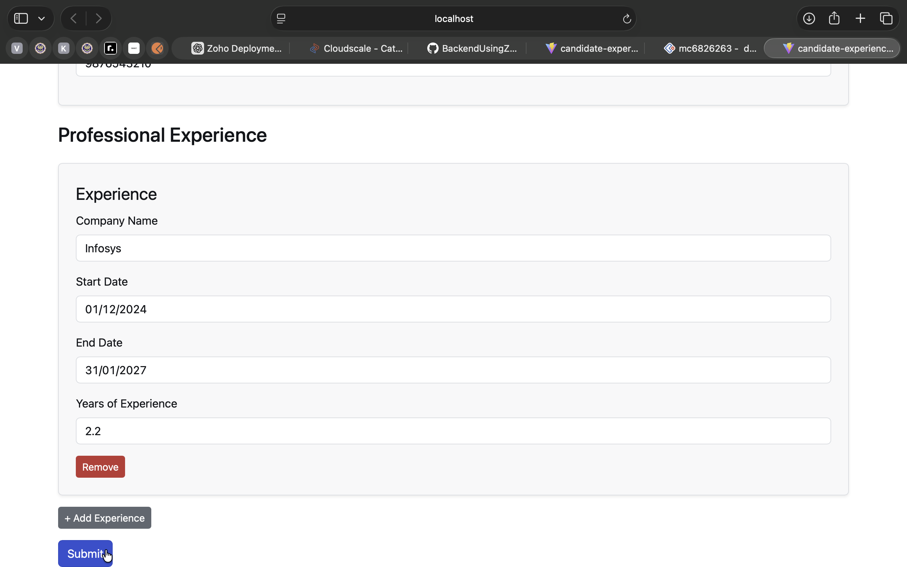
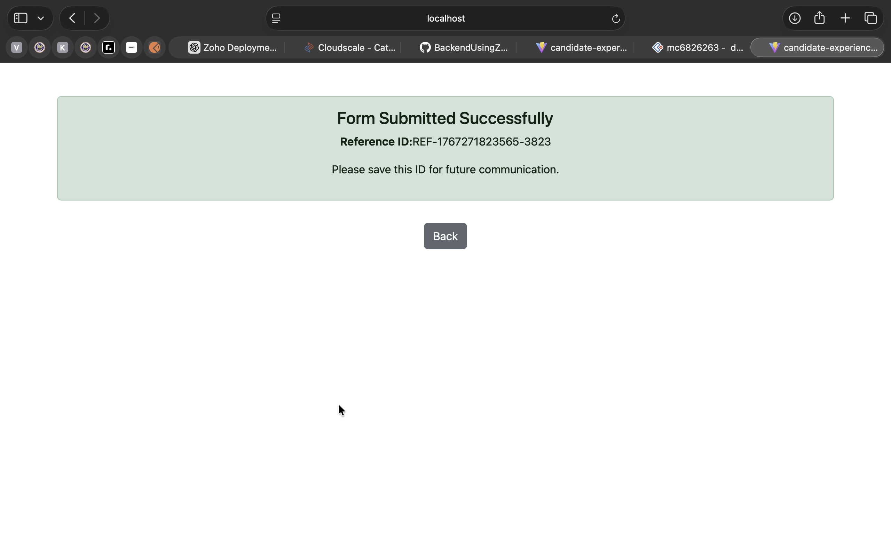
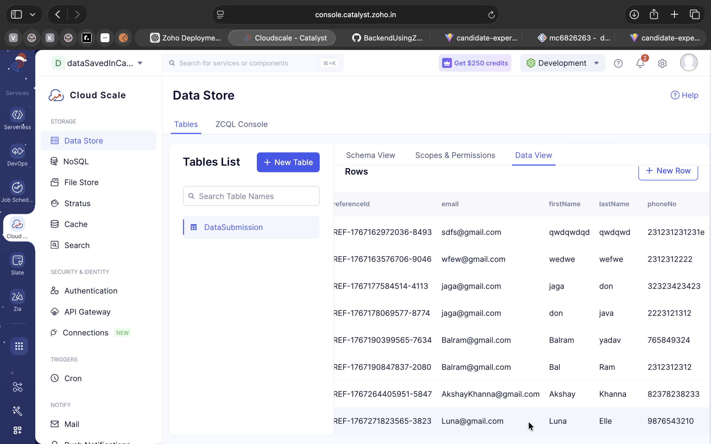
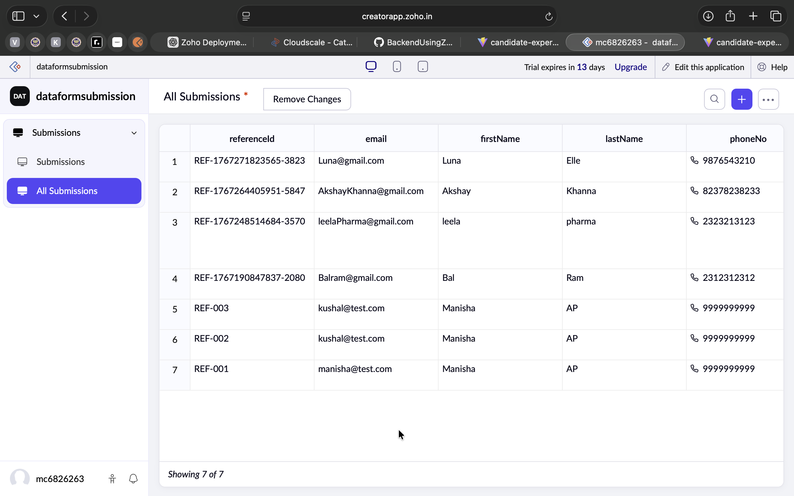
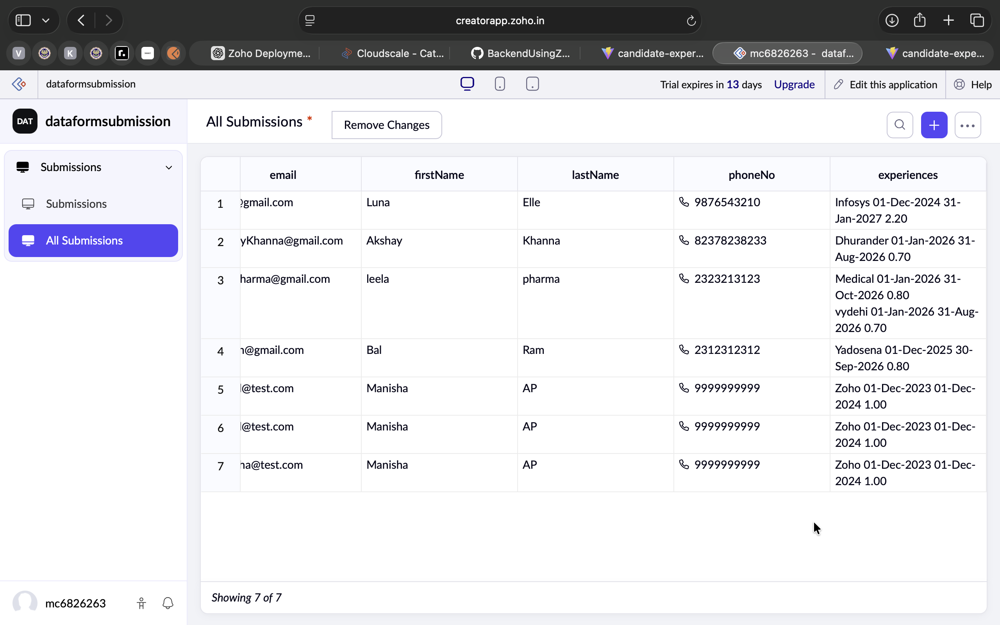
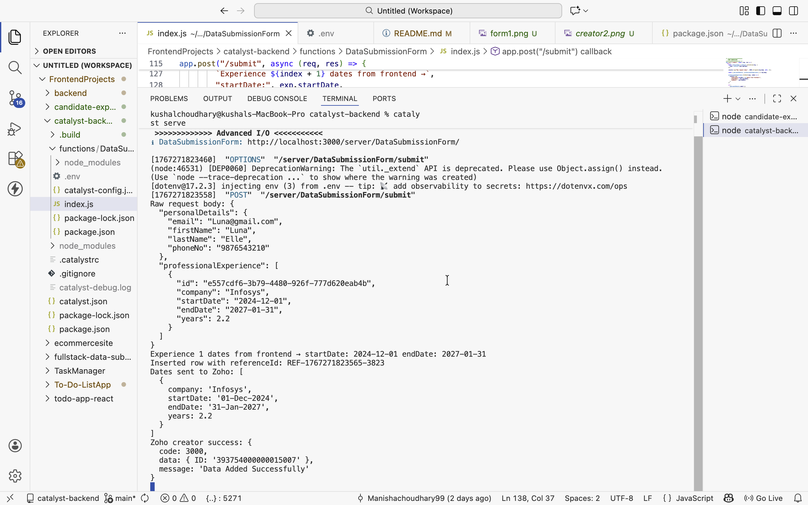

## Full-Stack Data Submission Application (Zoho-Integrated)

### 1. Project Overview
This project is a full-stack web application that allows external users to submit their personal and professional experience details through a publicly accessible web form. The application follows a defined data submission flow where user data is first persisted in the application’s backend data store and then integrated with Zoho services.
The primary goal of this project is to demonstrate full-stack development skills, serverless backend implementation using Zoho Catalyst, and third-party integration with Zoho Creator.

#### Key Features
Public-facing data submission form
Dynamic, repeatable professional experience section
Auto-calculation of years of experience
Unique Reference ID generation for each submission
Backend validation and persistence
Successful integration with Zoho Creator

### 2. Architecture Overview

High-Level Data Flow

Frontend (React.js - Vite)
        ↓
Backend (Zoho Catalyst Advanced I/O – Node.js)
        ↓
Zoho Catalyst Data Store
        ↓
Zoho Creator

### Technology Stack

Frontend: React.js (Vite)
Backend: Zoho Catalyst Advanced I/O Function (Node.js runtime, JavaScript)
Database: Zoho Catalyst Data Store
Hosting Target: Zoho Catalyst (currently running locally. Fully prepared for deployment)
Integrations: Zoho Creator

### 3. Setup Instructions (Local)

Prerequisites

Node.js (v18 or above)
npm
Zoho account with access to Catalyst and Creator

Frontend Setup (The frontend runs locally using vite)

git clone <repository-url>
cd frontend
npm install
npm run dev

Backend Setup (Zoho Catalyst Advanced I/O serverless function)

git clone <repository-url>
cd backend
npm install
To start the backend locally:
catalyst serve

### 4. Deployment Details (Zoho Catalyst)

Intended Deployment
Frontend to be hosted as a Catalyst web client
Backend to be deployed as a Catalyst Advanced I/O function
Environment variables to be configured via Catalyst console

Current Status
The application works end-to-end in the local development environment
Deployment to Zoho Catalyst was attempted
Due to environment configuration and OAuth-related constraints, full deployment could not be completed within the given timeline
The codebase is structured and prepared for Catalyst deployment

Deployment Status 

Both frontend and backend are fully functional in the local development environment. Deployment to Zoho Catalyst was planned and the codebase is structured for hosting, but full deployment could not be completed due to configuration constraints.

### 5. Environment Variables & Configuration
Backend environment variables are managed using a .env file (not committed).

ZOHO_REFRESH_TOKEN=1000.9a1434bca26aee318e0689b1f6ebe1aa.b9d56485eb317e11446bed21db5651bd
ZOHO_CLIENT_ID=1000.LBDSY771RFG40430K1LU2VC859K89S
ZOHO_CLIENT_SECRET=fe25cc8dcb280056b6889c68378a9f284a2b198113

### 6. Database Schema / Data Model

#### Data Store Table: DataSubmission

| Field Name   | Type         | Description           |
|--------------|--------------|-----------------------|
| referenceId  | String(Text) | Unique reference ID generated in backend (`REF-<timestamp>-<random4digits>`) |
| email        | String       | User email address    |
| firstName    | String       | First name            |
| lastName     | String       | Last name             |
| phone        | String       | Phone number          |
| experiences  | String       | List of professional experience as Array of objects |

#### Experience Object Structure

| Field Name   | Type   | Description |
|-------------|--------|-------------|
| companyName | String | Name of the company |
| startDate   | Date   | Start date of the experience |
| endDate     | Date   | End date of the experience |
| years       | Number | Auto-calculated years of experience based on startDate and endDate |

### 7. Zoho Integrations
Zoho Creator (Implemented)
Data is pushed to Zoho Creator after successful persistence in Catalyst Data Store
Integration is implemented using Zoho Creator REST APIs
OAuth 2.0 authentication with refresh token mechanism
Each submission results in a new record in Zoho Creator

Zoho CRM (Not Implemented)
Zoho CRM integration was planned as a bonus enhancement
Not implemented due to time constraints

### 8. Repositories Structure
This project is submitted as two separate repositories:
Frontend Repository: Contains the React.js (Vite) client application
Backend Repository: Contains the Zoho Catalyst Advanced I/O backend function
This approach was chosen to:
Maintain clear separation of concerns
Preserve incremental commit history for both frontend and backend development
Both repositories together represent a single end-to-end system.

## 9. Sample Data & Proof of Execution

Included Proof

### 1. Successful form submission

### 2. Successful Database Insertion (Zoho Catalyst Data Store)

### 3. Successful record creation in Zoho Creator

### 10. Assumptions, Limitations & Known Issues

Assumptions

1. Users submit at least one professional experience entry. The form does not allow empty experience submissions
2. Authentication is not required for public submissions. Anyone on the internet can submit the form .No login, signup, or authentication is required
3. The application is designed for low to moderate submission volume

Limitations

1. Zoho CRM integration not implemented
2. Full Catalyst deployment not completed

Known Issues

OAuth and environment configuration issues during Catalyst deployment
Limited error handling for edge cases
Logging and monitoring not implemented

### 11. Optional Enhancements (Planned / Partial)
✔ Dynamic form handling
✔ Input validation (basic)
❌ Zoho CRM integration
❌ Centralized logging and monitoring
❌ Unit / integration tests

### 12. Conclusion
This project demonstrates a complete full-stack data submission workflow using a serverless backend on Zoho Catalyst and successful integration with Zoho Creator. While deployment to Catalyst could not be finalized within the timeline, the application functions end-to-end locally and is structured according to production-ready architectural principles.